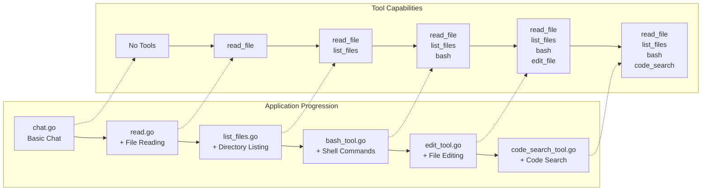
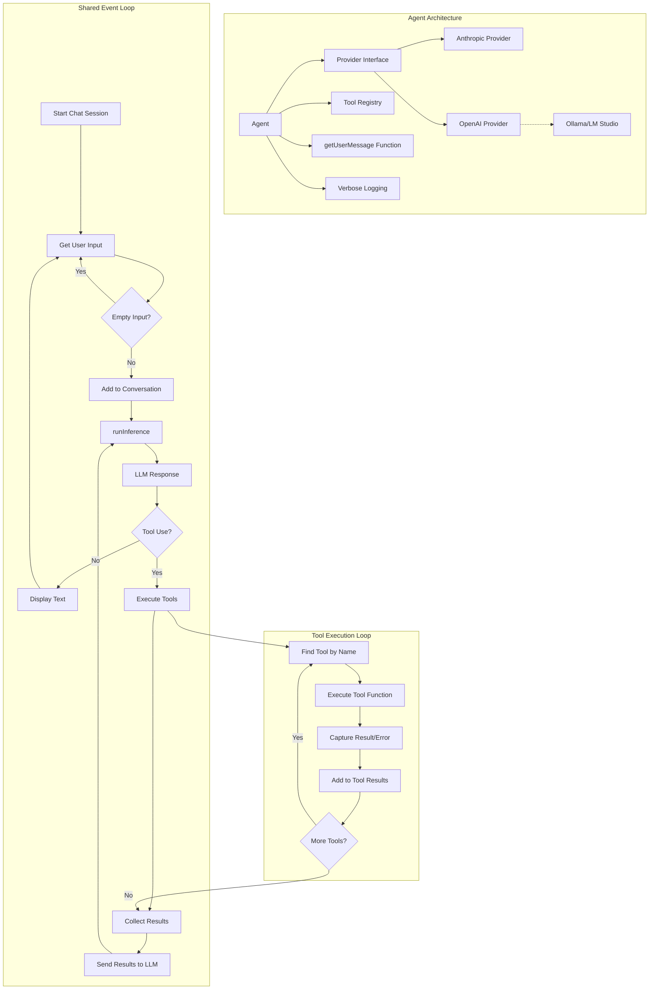

# 🧠 Build Your Own Coding Agent via a Step-by-Step Workshop

Welcome! 👋 This workshop will guide you through building your own **AI-powered coding assistant** — starting from a basic chatbot, and adding powerful tools like file reading, shell command execution, and code searching.

You don’t need to be an AI expert. Just follow along and build step-by-step!

🌐 **Want a detailed overview?** Check out the blog post: [ghuntley.com/agent](https://ghuntley.com/agent/)

---

## 🎯 What You'll Learn

By the end of this workshop, you’ll understand how to:

- ✅ Connect to AI providers (Anthropic Claude, OpenAI, Ollama, LM Studio, etc.)
- ✅ Build a provider-agnostic AI chatbot
- ✅ Add tools like reading files, editing code, and running commands
- ✅ Handle tool requests and errors
- ✅ Build an agent that works with multiple LLM providers

---

## 🛠️ What We're Building

You’ll build 6 versions of a coding assistant. 

Each version adds more features:

1. **Basic Chat** — talk to your AI assistant
2. **File Reader** — read code files
3. **File Explorer** — list files in folders
4. **Command Runner** — run shell commands
5. **File Editor** — modify files
6. **Code Search** — search your codebase with patterns



At the end, you’ll end up with a powerful local developer assistant!


---

## 🧱 How It Works (Architecture)

Each agent works like this:

1. Waits for your input
2. Sends it to the AI provider
3. The AI may respond directly or ask to use a tool
4. The agent runs the tool (e.g., read a file)
5. Sends the result back to the AI
6. The AI gives you the final answer

We call this the **event loop** — it's like the agent's heartbeat.



## 🚀 Getting Started

### ✅ Prerequisites

* Go 1.24.2+ or [devenv](https://devenv.sh/) (recommended for easy setup)
* An API key from one of the supported providers:
  * [Anthropic Claude](https://www.anthropic.com/product/claude) (default)
  * [OpenAI](https://platform.openai.com/)
  * Or a local model server like [Ollama](https://ollama.ai/) or [LM Studio](https://lmstudio.ai/)

### 🔧 Set Up Your Environment

**Option 1: Recommended (using devenv)**

```bash
devenv shell  # Loads everything you need
```

**Option 2: Manual setup**

```bash
# Make sure Go is installed
go mod tidy
```

### 🔐 Configure Your AI Provider

The agents support multiple AI providers. By default, they use Anthropic Claude.

**Option 1: Using Anthropic Claude (default)**

```bash
export ANTHROPIC_API_KEY="your-api-key-here"
```

**Option 2: Using OpenAI**

```bash
export PROVIDER="openai"
export OPENAI_API_KEY="your-api-key-here"
# Optional: specify a different model
export OPENAI_MODEL="gpt-4"
```

**Option 3: Using Ollama (local)**

```bash
export PROVIDER="openai"
export OPENAI_BASE_URL="http://localhost:11434/v1"
export OPENAI_MODEL="llama2"  # or any model you have installed
# No API key needed for local Ollama
```

**Option 4: Using LM Studio (local)**

```bash
export PROVIDER="openai"
export OPENAI_BASE_URL="http://localhost:1234/v1"
export OPENAI_MODEL="local-model"  # check LM Studio for the exact model name
# No API key needed for local LM Studio
```

---

## 🏁 Start with the Basics

### 1. `chat.go` — Basic Chat

A simple chatbot that talks to your chosen AI provider.

```bash
go run chat.go
```

* ➡️ Try: “Hello!”
* ➡️ Add `--verbose` to see detailed logs

---

## 🛠️ Add Tools (One Step at a Time)

### 2. `read.go` — Read Files

Now your AI assistant can read files from your computer.

```bash
go run read.go
```

* ➡️ Try: “Read fizzbuzz.js”

---

### 3. `list_files.go` — Explore Folders

Lets your AI assistant look around your directory.

```bash
go run list_files.go
```

* ➡️ Try: “List all files in this folder”
* ➡️ Try: “What’s in fizzbuzz.js?”

---

### 4. `bash_tool.go` — Run Shell Commands

Allows your AI assistant to run safe terminal commands.

```bash
go run bash_tool.go
```

* ➡️ Try: “Run git status”
* ➡️ Try: “List all .go files using bash”

---

### 5. `edit_tool.go` — Edit Files

Your AI assistant can now **modify code**, create files, and make changes.

```bash
go run edit_tool.go
```

* ➡️ Try: “Create a Python hello world script”
* ➡️ Try: “Add a comment to the top of fizzbuzz.js”

---

### 6. `code_search_tool.go` — Search Code

Use pattern search (powered by [ripgrep](https://github.com/BurntSushi/ripgrep)).

```bash
go run code_search_tool.go
```

* ➡️ Try: “Find all function definitions in Go files”
* ➡️ Try: “Search for TODO comments”

---

## 🔌 Provider Support

This workshop supports multiple AI providers through a clean interface abstraction:

### Supported Providers

1. **Anthropic Claude** (default)
   - Full tool/function calling support
   - Best for complex reasoning tasks
   - Requires: `ANTHROPIC_API_KEY`

2. **OpenAI**
   - Compatible with GPT-4, GPT-3.5, and other OpenAI models
   - Full tool/function calling support
   - Requires: `PROVIDER=openai`, `OPENAI_API_KEY`

3. **Ollama** (local)
   - Run models locally on your machine
   - No API key needed
   - Supports tool calling with compatible models (llama2, mistral, etc.)
   - Requires: `PROVIDER=openai`, `OPENAI_BASE_URL=http://localhost:11434/v1`

4. **LM Studio** (local)
   - Another option for running models locally
   - No API key needed
   - Check model compatibility for tool calling
   - Requires: `PROVIDER=openai`, `OPENAI_BASE_URL=http://localhost:1234/v1`

### How It Works

The codebase uses a **Provider Interface** that abstracts away provider-specific details:

- `Provider` interface defines the contract all providers must implement
- `AnthropicProvider` wraps the Anthropic SDK
- `OpenAIProvider` uses the OpenAI-compatible API format (works with OpenAI, Ollama, LM Studio, etc.)
- Agents interact only with the `Provider` interface, making them provider-agnostic

This means you can switch providers by just changing environment variables!

---

## 🧪 Sample Files (Already Included)

1. `fizzbuzz.js`: for file reading and editing
1. `riddle.txt`: a fun text file to explore
1. `AGENT.md`: info about the project environment

---

## 🐞 Troubleshooting


**API key not working?**

* Make sure it's exported: `echo $ANTHROPIC_API_KEY` or `echo $OPENAI_API_KEY`
* For Anthropic: Check your quota on [Anthropic's dashboard](https://www.anthropic.com)
* For OpenAI: Check your quota on [OpenAI's platform](https://platform.openai.com)

**Using Ollama or LM Studio?**

* Make sure the server is running (check `http://localhost:11434` for Ollama or `http://localhost:1234` for LM Studio)
* Verify the model name matches what's installed: `ollama list` (for Ollama)
* Set `PROVIDER=openai` and `OPENAI_BASE_URL` to point to your local server

**Go errors?**

* Run `go mod tidy`
* Make sure you’re using Go 1.24.2 or later

**Tool errors?**

* Use `--verbose` for full error logs
* Check file paths and permissions

**Environment issues?**

* Use `devenv shell` to avoid config problems

---

## 💡 How Tools Work (Under the Hood)

Tools are like plugins. You define:

* **Name** (e.g., `read_file`)
* **Input Schema** (what info it needs)
* **Function** (what it does)

Example tool definition in Go:

```go
var ToolDefinition = ToolDefinition{
    Name:        "read_file",
    Description: "Reads the contents of a file",
    InputSchema: GenerateSchema[ReadFileInput](),
    Function:    ReadFile,
}
```

Schema generation uses Go structs — so it’s easy to define and reuse.

---

## 🧭 Workshop Path: Learn by Building

| Phase | What to Focus On                                 |
| ----- | ------------------------------------------------ |
| **1** | `chat.go`: API integration and response handling |
| **2** | `read.go`: Tool system, schema generation        |
| **3** | `list_files.go`: Multiple tools, file system     |
| **4** | `bash_tool.go`: Shell execution, error capture   |
| **5** | `edit_tool.go`: File editing, safety checks      |
| **6** | `code_search_tool.go`: Pattern search, ripgrep   |

---

## 🛠️ Developer Environment (Optional)

If you use [`devenv`](https://devenv.sh/), it gives you:

* Go, Node, Python, Rust, .NET
* Git and other dev tools

```bash
devenv shell   # Load everything
devenv test    # Run checks
hello          # Greeting script
```

---

## 🚀 What's Next?

Once you complete the workshop, try building:

* Custom tools (e.g., API caller, web scraper, database query)
* Tool chains (run tools in a sequence)
* Memory features (remember things across sessions)
* A web UI for your agent
* Integration with additional AI providers (Azure OpenAI, Google Vertex AI, etc.)

---

## 📦 Summary

This workshop helps you:

* Understand provider-agnostic agent architecture
* Learn to build smart assistants that work with any LLM
* Grow capabilities step-by-step
* Practice using multiple AI providers with Go

---

Have fun exploring and building your own AI-powered tools! 💻✨

If you have questions or ideas, feel free to fork the repo, open issues, or connect with the community!
